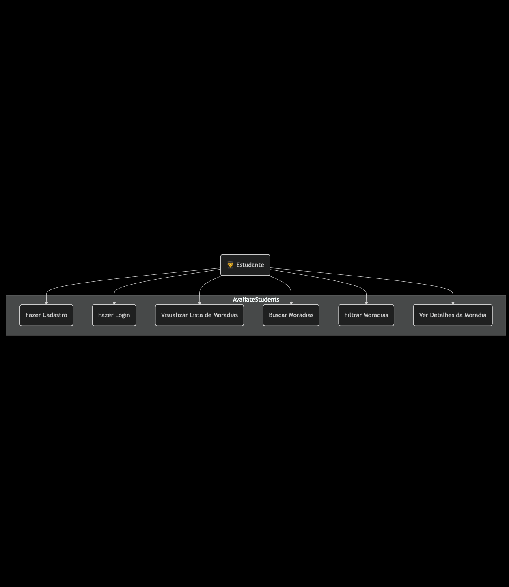

# AvaliateStudents 🏡

## 1. Descrição do Projeto

AvaliateStudents é um aplicativo móvel, desenvolvido para a disciplina de Programação para Dispositivos Móveis, que visa criar uma plataforma para estudantes encontrarem, visualizarem e avaliarem moradias universitárias. O projeto facilita a busca por um novo lar, trazendo mais transparência e segurança para a comunidade estudantil.

## 2. Funcionalidades (Entrega 1)

- [ ] Cadastro e Login de usuários (Estudantes).
- [ ] Visualização de uma lista de moradias com dados estáticos ("mockados").
- [ ] Tela de detalhes para cada moradia.
- [ ] Esqueleto das telas de Perfil e Filtro.
- [ ] Navegação funcional entre as telas implementadas.

## 3. Tecnologias Utilizadas

- **App (Frontend):** React Native com Expo
- **Linguagem:** TypeScript
- **Navegação:** React Navigation (via Expo Router)
- **Estilização:** StyleSheet nativo (Flexbox)
- **Prototipação:** Figma

## 4. Diagrama de Casos de Uso

---

## 5. Protótipo (Figma)

O protótipo navegável do projeto, com o fluxo de telas da primeira entrega, pode ser acessado no link abaixo.

[➡️ Visualizar Protótipo do AvaliateStudents no Figma](https://www.figma.com/design/a7OVs61HbxlT3c3tP8GyXr/Sem-t%C3%ADtulo?node-id=2-170&t=GlEIy3610zuiOu88-1)
